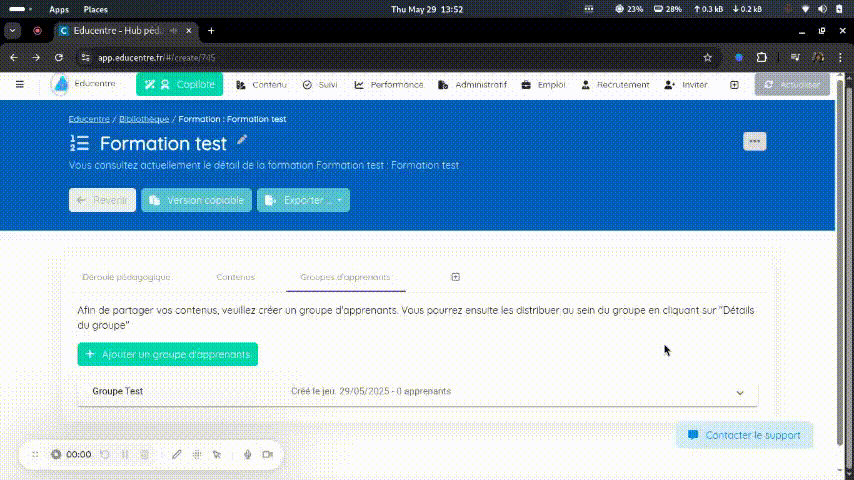
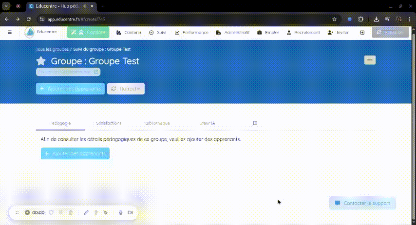
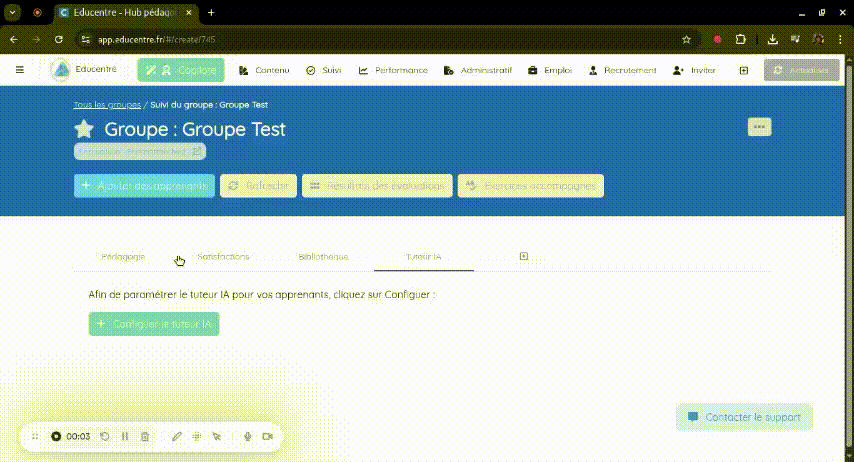
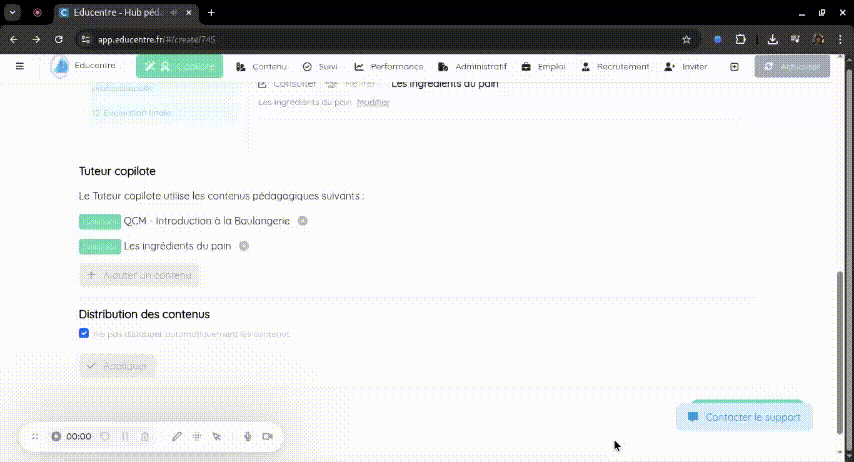

# Tutoriel

## Stimuler les apprenants avec le Tuteur IA

### ✅ Prérequis

Avant de commencer, assurez-vous d’avoir :

- Créé une formation
- Généré du contenu pédagogique (QCM, slides, etc.)
- Créé un groupe d’apprenants

### 🛠️ Étapes

1. **🔓 Activer le Tuteur IA pour un groupe d’apprenants**  
   Activer le tuteur pour votre groupe.  
   

2. **⚙️ Configurer le Tuteur IA**  
   Personnalisez les paramètres pour adapter le comportement du tuteur à vos objectifs pédagogiques.  
   

3. **📥 Enrichir le Tuteur IA avec des questions**  
   Alimentez le tuteur en sélectionnant les QCM et autres ressources pédagogiques.  
   

4. **🧪 Tester l’expérience du Tuteur IA**  
   Lancez une session de test pour visualiser le fonctionnement et affiner l’expérience d’apprentissage.  
   
