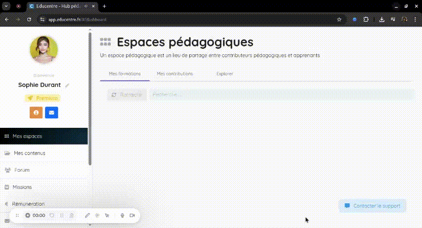
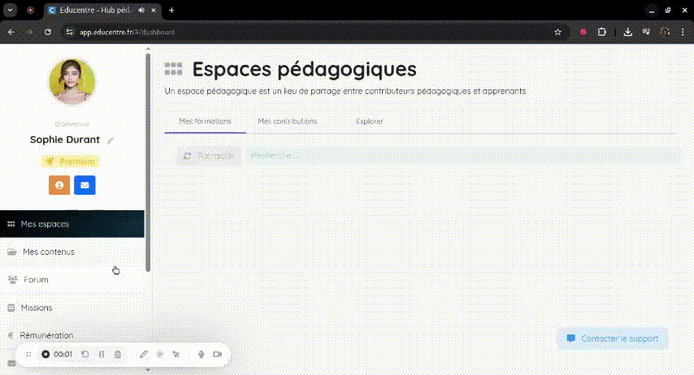
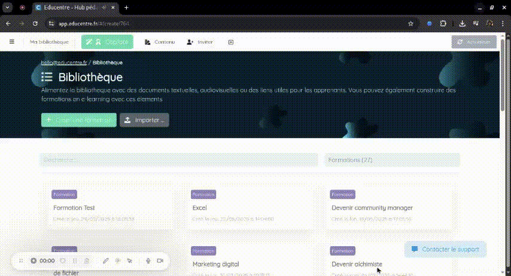
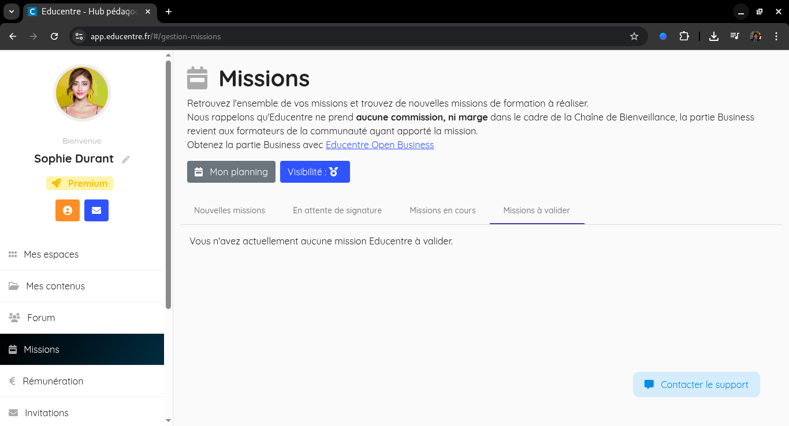

# Tutoriel

### ✅ Prérequis

Afin d'intervenir auprès de nos centres partenaires, vous devez disposez :

- d'un compte formateur sur Educentre
- d'un numéro de SIRET à votre nom
- d'un numéro NDA

### 🛠️ Étapes

1. Remplir toutes les tâches vous permettants d'être conforme

2. Postuler à une mission

3. Une fois séléctionné pour une mission, signer son contrat

4. Créer sa formation, ses présentations de concept et évaluations avec les agents Educentre
[Voir comment générer du contenu avec les agents Educentre](../../agents/0-presentation.md)

5. En fin de mission, récolter la satisfaction des apprenants

6. Ajouter un commentaire d'appréciation pour chaque apprenant
[Voir comment corriger automatiquement avec les agents Educentre](../../agents/0-presentation.md)

7. Valider sa mission

8. Générer sa facture et l'envoyer à factures@educentre.fr
