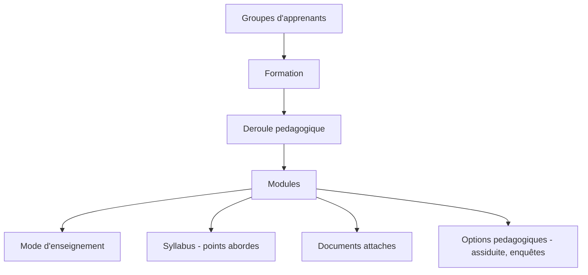

# 📚 Gestion des formations

Dans **Educentre**, la gestion des formations repose sur une approche simple mais innovante : vous ne gérez pas tant des "formations" de manière isolée, comme dans d'autres plateformes, mais plutôt des **groupes d'apprenants** qui suivent un **déroulé pédagogique**.

## 🧠 Une logique centrée sur les groupes

Chaque formation est en réalité un **modèle de déroulé pédagogique** : un ensemble structuré de modules, de ressources et d'activités. Ces modèles servent ensuite à créer des **groupes d'apprenants**, qui suivent ce parcours, avec des options de personnalisation individuelle.

## 🎓 Trois types de formation

Educentre propose **trois types de formation** (modèles pédagogiques) :

1. **Présentielle** : avec un planning structuré, formateurs et salles, modules asynchrones
2. **E-learning classique** : déroulé libre, modules asynchrones
3. **E-learning interactif (navigation vive)** : vidéos interactives avec scénarisation avancée, simulent la présence d’un formateur

## ♻️ Réutiliser et adapter les formations

Les modèles pédagogiques peuvent être :

- **Réutilisés** pour plusieurs groupes
- **Adaptés** selon les besoins
- **Individualisés** pour chaque apprenant en pédagogie asynchrone ou en e-learning

C'est ce qui rend leur création particulièrement puissante : ils sont **pleinement éditables** et peuvent être enrichis au fil du temps. 

De plus, si vous utilisez le module **Educentre Agents**, vous pouvez confier la création d'un déroulé pédagogique à l'**IA**, qui le générera automatiquement à partir d'objectifs, d'un public cible, ou de compétences visées.

Un autre atout : vous pouvez **simuler un déroulé pédagogique** dans une classe virtuelle avec des profils types d'apprenants et de formateurs. Ce test dynamique permet de vérifier la **progressivité pédagogique** et la cohérence globale du programme, comme une sorte de "lancement test" avant diffusion réelle.

## 🧹 Composition d’un modèle de formation

Un modèle de formation comprend :

- Des **modules**, chacun pouvant être tagué selon son mode de réalisation : *présentiel*, *autonomie*, *distanciel*, *visioconférence*...
- Un **syllabus** par module, listant les points à aborder dans la séquence
- Des **documents attachés** : supports de cours, évaluations, vidéos, ateliers ou TP, liens externes, etc.
- Des **options pédagogiques** et administratives : déclenchement automatique, gestion de la solidité des parcours, enquêtes de satisfaction, etc.

## 📅 Génération automatique de planning

À partir d’un modèle de formation, Educentre peut automatiquement :

- Générer un planning en fonction d’une date de début
- Calculer le **volume horaire**
- Positionner des **formateurs**
- Réserver des **salles**
- Déclencher des **évaluations** et **enquêtes de satisfaction** (utile pour les audits Qualiopi)

---

## ♻️ Diagramme de fonctionnement

Ce diagramme simplifié montre la structure pédagogique dans Educentre :

- Les **groupes d'apprenants** suivent une **formation**
- Chaque formation contient un **déroulé pédagogique**
- Le déroulé est structuré en **modules**, chacun avec :
  - Un **mode d'enseignement** (présentiel, e-learning, autonomie...)
  - Un **syllabus** listant les points abordés
  - Des **documents** : cours, évaluations, vidéos, TP, etc.
  - Des **options** telles que la gestion de l’assiduité et des enquêtes de satisfaction

Cette flexibilité permet de construire facilement des classes **hybrides** mêlant plusieurs formats pédagogiques.

---

## 💡 Bon à savoir

- **Le moteur de gestion et de planification est extrêmement puissant**, pensé pour faire gagner un temps considérable à tous les utilisateurs : il anticipe les conflits, optimise les ressources, et permet un pilotage clair des sessions.
- La plateforme **a été conçue pour être intuitive** : l'expérience utilisateur a toujours été au cœur du développement d’Educentre. Chaque action est fluide, naturelle, et permet d’avancer rapidement sans surcharge technique.
- Les **modèles de formation** (déroulés pédagogiques) sont un gain de temps **majeur** : ils vous permettent de créer une fois, et de réutiliser, adapter ou dupliquer à volonté.
- L’interface vous guide pour personnaliser ou réviser vos parcours même après leur lancement, avec souplesse et efficacité.
- L'interopérabilité avec des outils comme le module Qualiopi est **native et directe**, vous assurant une conformité continue sans complexité.

**N’hésitez pas à exploiter pleinement ces fonctionnalités** : elles sont pensées pour faciliter votre quotidien pédagogique tout en vous offrant une rigueur professionnelle de haut niveau.

---

